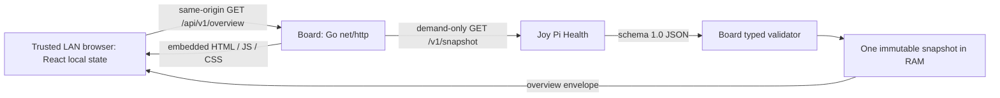

# Architecture

Status: **S00/S01 complete; S02 implemented and verified locally; CI closure pending**. Current S02 P-02/P-04/P-05 approval comes from the explicit implementation instruction, not the earlier documentary preparation. See [decisions](decisions.md) and [S02 evidence](s02-evidence.md). S03/S04 remain unimplemented.

## Boundaries and flow



Health alone owns collection. Board owns presentation, provider integration, bounded volatile fallback and HTTP delivery. The browser owns view state, refresh scheduling and its own reachability/freshness indicators. A browser failure cannot establish whether Health is up or down.

Frontend: React/TypeScript, Vite build, CSS/CSS Modules, system fonts, local React state and Fetch API. No SSR, global store, large UI/chart library or backend framework. Backend: Go, standard library first, `net/http`, compiled frontend embedded with `go:embed`. No runtime Node/npm/Vite, reverse proxy or Internet access is required on the Pi.

Only one main route `/`; frontend talks only to relative Board endpoints. No browser Health URL, CORS policy or public provider proxy. A development Vite proxy may forward `/api` to Go; it never forwards browser requests directly to Health. A `.local` hostname is supplied by existing network resolution; Board provides no mDNS service.

## Package layout and build

**Implemented through S02**; no empty future packages are reserved:

```text
cmd/joy-pi-board/       main, wiring, signals, version/help
internal/config/       startup settings and validation
internal/healthschema/ implemented S01 schema validation and Board-owned DTOs
internal/health/       dedicated demand-only HTTP client (S02)
internal/overview/     one-slot state, clock, demand coordinator
internal/httpapi/      outer exact dispatcher, overview and safe common errors
internal/httpui/       existing embedded static asset handler, retained
internal/httpwire/     fixed shared errors and security headers
internal/eventlog/     bounded nonblocking transition sink
web/                   frontend sources, manifests and S00 tests
  assets.go            Go package embedding its own dist subtree
  dist/                generated Vite output; ignored, required before Go build
```

S00 `web/assets.go` declares `//go:embed dist` and uses `fs.Sub(compiled, "dist")`; `cmd/joy-pi-board` consumes that package through Board's module. The directive references a child directory, with **no `../`** traversal. Vite emits `web/dist`, ignored by Git. The implemented build order is pinned frontend install → checks/tests → Vite production build → Go compilation with embedded dist. No dummy assets or filesystem fallback exist. The isolated missing-dist check confirms compilation fails; the clean-source repeat and standalone binary checks are recorded in [S00 evidence](s00-evidence.md).

The binary serves actual embedded bytes, not files resolved from the current working directory. Validate by moving the binary into an empty directory and starting it without Node, source tree or dist. No service/package is created in this task.

## Provider call and volatile state

An overview request triggers one Health attempt, or joins an attempt still active under **APPROVED P-04**. No startup probe, scheduler, cache-hit shortcut or completed-flight reuse. The [API transport policy](board-api-v0.1.0.md#health-http-transport) owns P-02's dedicated HTTP-only client, one-second deadline, bounded read, no redirect/proxy/decompression/replay and single-address dial policy. Do not duplicate those constants in a frontend setting. S01 Decode is the only schema-validation authority.

Success stores exactly one immutable S01 Validated value with paired wall UTC success time and an elapsed origin. A valid partial snapshot replaces the whole value; no merging null leaves. Failure leaves the cache and success metadata unchanged. Snapshot expiry only affects presentation; retaining the one expired value or dropping its bytes is permissible, while metadata remains. Restart resets everything. Detached response views may temporarily retain an older immutable value while a newer one is published; their number/lifetime is bounded by admission and response deadlines, not a queryable history. No files, database, persistence or periodic cleanup worker is required.

Use a paired clock reading; retain the monotonic-bearing Go time value for elapsed comparisons and format a separate UTC copy for wire timestamps. Calling UTC/serializing and reconstructing the elapsed origin loses its monotonic association. A fake clock independently moves wall time and elapsed ticks and fires timers. Wall jumps alone must not affect age. A regressing/unverifiable elapsed reading fails closed at response finalization. The [P-05 API section](board-api-v0.1.0.md#browser-safe-elapsed-age-header) defines the exact generation cut, including server suspension limits and the distinct S03 browser obligations. No clock interface should access system metrics or sensors.

## Concurrent demand and ordering

**APPROVED P-04 — single active shared flight.** This limits duplicate Health work for the established ten-client target while ensuring each request after completion starts a new attempt. It is implemented in S02; hosted CI closure remains separate. Keep one mutex around coordinator state: accepting flag, active flight/sequence, cache value/success anchor, worker/waiter counts and last transition key. Network, decoding, snapshot compaction, response assembly/writes and log output happen outside the mutex.

### Flight lifecycle and terminal events

1. Admit the HTTP request through nonblocking capacity limits. A cancelled request starts/joins nothing. Under the coordinator lock, join only an **active nonterminal** flight; otherwise allocate a worker permit, install a new increasing sequence and capture start/deadline. A joining waiter never extends the deadline. The worker uses a service-lifecycle context and the original 1 s deadline, independent of the initiating browser context.
2. A departing caller detaches once and releases its request resources; it never converts context cancellation into a provider failure. If some callers remain, they continue. If all depart, recommend keeping the orphan active until its ordinary completion/deadline, permitting new demand to join it while still active. It may publish a valid result within that original deadline. Zero waiters is **not** a terminal event, does not create a new flight, and never causes an autonomous follow-up. The one deadline timer exists only while an attempt is active; it is not polling.
3. The worker reads/bounds/validates outside the lock. It captures a paired success anchor at completion of receipt/validation and submits it with immutable Validated, or submits a classified failure. A lifecycle deadline supervisor can finish the flight even if a test transport ignores cancellation. Terminal events are: **candidate commitment before the deadline**, **elapsed deadline reached**, or **service shutdown**. Receiving bytes or final HTTP headers alone does not permit the next flight; their candidate must pass the atomic terminal transition. A non-200 candidate needs no body parsing. At exact deadline, timeout wins; shutdown already marked under the lock rejects all subsequent publication.
4. Exactly one terminal transition wins under the lock: verify active sequence/nonterminal/service state and deadline; publish new cache and the candidate's original wall/elapsed anchor for success only (do not refresh the anchor after lock contention); construct a private immutable flight view (success snapshot or failure with the then-current fallback metadata); mark terminal, detach active, and close its done signal once. These operations form one atomic publication. No replacement can be installed between cache update and signal. A deadline publishes a timeout outcome with unchanged cache; shutdown wakes waiters with Board unavailability/cancellation and **does not** publish a Health failure. Release the lock before cancellation/body close/log delivery. Timer/worker races cannot signal twice or rewrite the cache.
5. A new admitted request arriving after that transition starts a **new** attempt; there is no reusable result window. A request racing with completion either joined before the cut or starts after it. A worker returning after timeout/shutdown, or with a nonmatching sequence, discards everything, including success timestamps and transition logs. Do not rely on context cancellation alone to protect publication.
6. Each live waiter receives its flight's view. Even if another flight succeeds/fails before it serializes, it never combines an old reason with newer cache data. It recomputes elapsed age on the **view's** anchor at finalization (P-05): delayed failed-flight fallback may become none; a very old successful view is rejected as a Board delivery failure. Response delivery never writes shared provider state. Once a caller is cancelled no response is attempted for it; other callers are unaffected.

The logical active slot is cleared by terminal publication, not by completion of response writes and not merely by “body read finished”. A timed-out worker may still be returning after a successor starts. Keep its worker permit until its actual exit, separately from the logical active slot; cap unfinished workers at 32 and reject new work with safe Board 503 if exhausted. The real standard transport is expected to unblock on cancellation; adversarial fakes explicitly release held work during cleanup. This bounds outstanding work without pretending arbitrary goroutines can be forcibly killed. No unbounded channel, waiter queue or replacement goroutine per retry. Standard request/connection limits are in [the API](board-api-v0.1.0.md#supplemental-http-surface).

Tests S02-T06/T07 use barriers before candidate publication, after timeout, before response finalization and while a writer is blocked. Assert sequence, view coherence, exact attempts, no stale publication, independent cancellations, orphan termination and bounded permits under race detection. The frontend's own out-of-order request guard remains S03, not a server substitute.

## Startup, configuration and operations

All supplemental choices here are **APPROVED S02 P-02**; P-01's defaults and the established 1 s/30 s/5 s budgets remain approved. See [S02 tasks](sprint-02.md#tasks-and-dependency-order) and S02-T01/T10/T11.

### Configuration recommendation

| Setting | Flag / environment | Default / validation |
|---|---|---|
| Listener | `--listen` / `JOY_PI_BOARD_LISTEN` | **0.0.0.0:8081**, unchanged. Numeric IPv4 or bracketed IPv6 host plus decimal port 0–65535; reject hostname listeners, empty host, whitespace, zones, services and malformed socket text. Port 0 stays allowed for existing tests and explicitly ephemeral development; production uses its configured fixed port. |
| Health endpoint | `--health-url` / `JOY_PI_BOARD_HEALTH_URL` | **http://127.0.0.1:8080/v1/snapshot**, unchanged. Absolute `http` only, explicit numeric port 1–65535, literal IP or ASCII DNS hostname, exact literal `/v1/snapshot`; reject credentials, fragment (even empty delimiter), query (even bare `?`), escaped path aliases, opaque URLs, whitespace, zones and empty host. No startup resolution or reachability check. |
| Informational actions | `--help` (`-h` compatibility), `--version`; no environment equivalent | Print fixed help/build identity and exit 0 without bind, Health work or operational config validation. Version uses build metadata with honest `unknown` defaults, not a forged release identifier. |

Precedence is explicit flag → **present** environment variable → default; an explicitly empty flag/environment is invalid rather than falling back. Use presence-aware flag tracking. Reject duplicate flags, positionals and unknown flags with exit 2. Parse syntax first; conflicting help+version or informational flags mixed with operational flags fail with exit 2, otherwise informational actions bypass invalid environment. Validate only the effective setting: an explicit valid flag can override an invalid environment value. Unknown unrelated environment variables have no effect. Diagnostics identify the setting and rule, not the rejected value/URL or raw flag-parser error. Help emits fixed usage; configuration failure emits a setting/rule diagnostic without reflecting supplied arguments. Configuration is not exposed via HTTP/UI. Timeout/freshness/capacity constants have no tuning flags in S02.

These restrictions deliberately prefer a predictable LAN-only baseline; HTTP-only and explicit provider port/path refine previous P-02 prose, not Health configuration. Do not change Health to match Board. DNS is allowed only for the provider and uses existing resolution; Board adds no mDNS. Binding failure is a safe Board startup error (exit 1), not a provider reason; never auto-pick a replacement port. Test busy-port, malformed/empty settings, flag/env precedence and no-network help/version paths.

### Startup, shutdown and logs

Validate settings and embedded assets, construct idle dependencies (no I/O), bind listener, then Serve. Readiness is successful serving of `/` and its required embedded assets, independent of Health; recommend no extra readiness endpoint. Preserve the established ≤2 s budget; local controlled startup checks are not Raspberry Pi acceptance.

On the first SIGTERM/SIGINT or an internal stop request, atomically close admission and mark the coordinator stopping, cancel active provider work, wake its waiters as Board shutdown, and call Server.Shutdown with the **same absolute 5 s stop deadline**. Existing static writes may drain; overview handlers do not wait for Health to return before recognizing shutdown. At deadline call Server.Close and return; no fresh 5 s interval, unbounded WaitGroup wait or background retry. Second signal may force Close immediately. Normal signal shutdown exits 0; startup/unexpected Serve/internal forced-shutdown failure exits 1. Request/worker counts are cleaned up, but cancellation-ignoring test workers cannot block process termination forever. Close idle upstream resources and stop per-flight timers. No systemd unit is created until S04.

Use fixed structured fields to stdout/stderr suitable for journald: starting, listening, stopping, stopped; build identity; first provider outcome, reason transitions/recovery and issue-availability transitions. Provider transition key is availability/reason plus ordered issue path/code, never metric values or issue message. Repeated same failures and ordinary poll success emit nothing. Compute bounded transition data from the S01 known projection; do not log hostname/interface text, snapshot bytes, upstream body, arbitrary error strings or the configured destination. Listener display can be a validated/bound address; sensitive URL settings are omitted. Keep Board error codes separate from provider reasons.

Assign transition sequence under the mutex but emit outside it. Recommend a bounded 64-event nonblocking sink; when the sink is blocked, aggregate a dropped-event count and later emit one fixed diagnostic instead of blocking HTTP or growing a queue. Shutdown does not exceed 5 s waiting for a blocked writer. Tests capture the sink, flood identical outcomes, inject malicious issue/URL/error text and block output. A bounded sanitized net/http ErrorLog adapter must not bypass this policy. Physical journald/service checks stay S04.

Future systemd uses a dedicated unprivileged `joy-pi-board` user, restrictive filesystem/service settings and no sensor/device privileges. Debian packaging must not add `Requires=joy-pi-health.service`, wait for Health in `ExecStartPre`, or require a Health package to start. No hard dependency on network-online or Internet is needed to bind the LAN address. Exact unit hardening and package scripts belong to S04 review and physical acceptance, not S02.

## S02 realization details

`overview.Coordinator` owns one mutex, a 32-worker bound and immutable flight views. A checked clock serializes paired readings and latches elapsed-clock regressions invalid. The real source uses `time.Time.Sub` on an unmodified process monotonic origin, and formats a UTC copy separately. Its duration range is bounded by Go; saturated elapsed durations are expired, never wrapped to young ages. Fake clocks explicitly fire deadline timers, without real 30 s waits.

`httpapi.Handler` composes `httpui`, enforces 32 request permits and performs at most three response assemblies when the conservative age bucket/eligibility changes before commitment. `httpapi.LimitedListener` caps open connections at 64. Static identity responses intentionally ignore conditional/range headers and return complete GET/HEAD resources; no new caching semantics or secondary static error router. `eventlog` keeps at most 64 queued events plus one writer goroutine. Publication assigns sequence numbers; the sink discards out-of-order older transitions. Shutdown does not wait beyond its original context for a blocked writer. The second signal cancels that same context before forced Close.

No production TypeScript consumer was added. The unchanged shell does not call overview. The test-only adapter, exact HTTP path and actual validation results are in [S02 evidence](s02-evidence.md).
