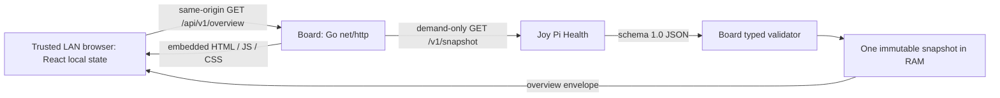

# Architecture

Status: **established boundaries, proposed realization; not implemented**. Requirements JPB-003–013, JPB-021–023. [Specification](specification-v0.1.0.md) owns scope; [Board API](board-api-v0.1.0.md) owns observable semantics; [decisions](decisions.md) identifies pending choices.

## Boundaries and flow



Health alone owns collection. Board owns presentation, provider integration, bounded volatile fallback and HTTP delivery. The browser owns view state, refresh scheduling and its own reachability/freshness indicators. A browser failure cannot establish whether Health is up or down.

Frontend: React/TypeScript, Vite build, CSS/CSS Modules, system fonts, local React state and Fetch API. No SSR, global store, large UI/chart library or backend framework. Backend: Go, standard library first, `net/http`, compiled frontend embedded with `go:embed`. No runtime Node/npm/Vite, reverse proxy or Internet access is required on the Pi.

Only one main route `/`; frontend talks only to relative Board endpoints. No browser Health URL, CORS policy or public provider proxy. A development Vite proxy may forward `/api` to Go; it never forwards browser requests directly to Health. A `.local` hostname is supplied by existing network resolution; Board provides no mDNS service.

## Future package layout and build

**Proposed P-02**; this is a design diagram, not an instruction to create empty directories now:

```text
cmd/joy-pi-board/       main, wiring, signals, version/help
internal/config/       startup settings and validation
internal/health/       HTTP client, schema validation, Board-owned DTOs
internal/overview/     one-slot state, clock, demand coordinator
internal/httpapi/      routing, API/static responses and security headers
web/                   frontend sources, manifests and tests in future S00
  assets.go            Go package embedding its own dist subtree
  dist/                generated Vite output; absent until frontend build
```

`web/assets.go` may declare `//go:embed dist` and use `fs.Sub(embedded, "dist")`; `cmd/joy-pi-board` consumes that package through Board's module. The directive references a child directory, with **no `../`** traversal. Keep deployable assets under `web/dist`; configure Vite output accordingly. Build from clean sources: pinned frontend install → checks/tests → Vite production build → verify output inventory → Go build embedding `web/dist`. A missing dist should fail the production Go build; do not ship dummy assets to disguise an incomplete build. Generated dist is proposed to be ignored by Git and regenerated in CI; S00 must prove a clean checkout works in that order. Test Go packages needing embed only after asset generation.

The binary serves actual embedded bytes, not files resolved from the current working directory. Validate by moving the binary into an empty directory and starting it without Node, source tree or dist. No service/package is created in this task.

## Provider call and volatile state

An overview request triggers one Health attempt, or joins an attempt still in progress under P-04. The global 1 s deadline covers connect, headers and entire body read; typed validation must be bounded and late results ignored. No immediate retry, including transparent replay of failed GETs by the HTTP transport. Implementation must configure/test transport behavior so one logical refresh does not silently resend on a failed reused connection. Disabling connection reuse is an acceptable proposed simple starting point; measure overhead before optimizing. Disable redirects: any non-200 including 3xx is `upstream_error`. Disable proxy-from-environment for the local default, compression negotiation and automatic alternate attempts unless explicitly reviewed in configuration policy.

Successful validation atomically publishes immutable snapshot bytes, wall-clock UTC success time and an elapsed-time origin. A valid partial response replaces the complete previous entry; null values are never filled from the old snapshot. Failure updates attempt outcome, leaves last-success metadata unchanged, and selects stale/none according to the monotonic age at response generation. No history, disk cache, startup restore or background refresh. The browser keeps only volatile React state, with no snapshot persistence in localStorage, sessionStorage or IndexedDB. Retaining at most the one expired snapshot in server RAM is allowed, but it must not be exposed after expiry; implementation may discard its bytes while retaining last-success metadata.

Use Go time values retaining their monotonic component for elapsed time; never round-trip them through RFC3339 before computing age. Inject a clock interface supporting wall UTC and elapsed time separately for tests. If elapsed time becomes unverifiable, fail closed on presenting old metrics. Wall-clock changes may make serialized `generated_at` appear earlier than `last_success_at`; they must not resurrect or prematurely age server data. `observed_at` is Health's observation timestamp, not the fallback-cache expiry anchor.

## Concurrent demand and ordering

**Proposed P-04:** one in-flight request per Board process, shared only by overlapping callers. A mutex protects `{active flight, latest immutable result, last success, monotonic origin, sequence}`. Do not hold it during network I/O, validation or response writes.

1. Under the lock, a live request either joins the active flight or installs a new flight with a monotonically increasing sequence. An already-cancelled caller starts nothing.
2. The new flight has a lifecycle-derived 1 s context, not the initiating browser's cancellation context. A departing waiter detaches; other waiters still get the same attempt outcome. An orphaned flight finishes within its original deadline and creates no next flight.
3. Receive, bound and validate outside the lock. Under the lock, publish a success and its timestamps once, associate the immutable outcome with the sequence, clear the active flight and signal waiters. Do not start a replacement until this commit is complete. A result arriving after timeout/cancellation or with a superseded sequence is discarded.
4. Every waiter builds its response from a consistent copy of that flight's outcome and associated cache metadata, recalculating age at serialization. A delayed response from an older flight never writes to current shared state. Frontend request generations also reject old/aborted responses.
5. A request arriving after a flight has completed starts a **new** attempt, even if the prior result is milliseconds old. No grace window, cache TTL reuse, autonomous timer or immediate retry is added by coalescing.

This serializes publication without network I/O under a global lock and keeps ten simultaneous clients from necessarily creating ten upstream calls. It is a realization proposal, not a claim that Board already coalesces. If independent concurrent calls are chosen instead, define sequence/commit rules preventing late success/failure from replacing newer state and repeat B-08 before approval. Cache reads and writes must pass the Go race detector.

## Startup, configuration and operations

**Proposed P-01/P-02 configuration surface:** flags `--listen`, `--health-url`, `--help`, `--version`; environment `JOY_PI_BOARD_LISTEN` and `JOY_PI_BOARD_HEALTH_URL`; precedence explicit flag → environment → default. Unknown flags, malformed socket addresses/URLs, credentials/fragments/query in provider URL or missing endpoint path fail startup with safe diagnostics and nonzero exit. Proposed provider URL policy: HTTP only for this trusted LAN baseline, absolute host/port and exact `/v1/snapshot` path. This configurable destination comes only from startup settings, never an API/browser parameter. Review before permitting other schemes or endpoint forms. Timeout and freshness constants remain established, not freely configurable behavior.

Proposed defaults: Board `0.0.0.0:8081`; Health `http://127.0.0.1:8080/v1/snapshot`. An occupied Board port is a clear Board startup error, never a reason to change Health's port. No reachability probe blocks startup/readiness. Readiness means the bound listener can serve embedded `/` and its assets; it does not mean Health is available. P-02 proposes using `/` as the readiness probe rather than adding another public endpoint.

Handle SIGTERM/SIGINT by closing admission, cancelling provider work and gracefully draining within the established 5 s bound, then exiting. Emit startup settings without secrets, build identity, readiness, significant provider/issue-state transitions, recovery and shutdown to stdout/stderr. Suppress repeated identical failures and routine poll successes; do not log snapshots, raw upstream bodies or unsafe error strings. Transition keys use provider reason and issue path/code, not changing metric values. Logging configuration and suppression must be testable.

Future systemd uses a dedicated unprivileged `joy-pi-board` user, restrictive filesystem/service settings and no sensor/device privileges. Debian packaging must not add `Requires=joy-pi-health.service`, wait for Health in `ExecStartPre`, or require a Health package to start. No hard dependency on network-online or Internet is needed to bind the LAN address. Exact unit hardening and package scripts belong to S04 review and physical acceptance, not this documentation task.
